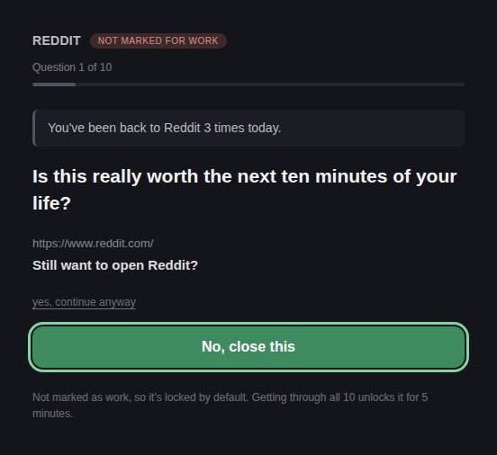
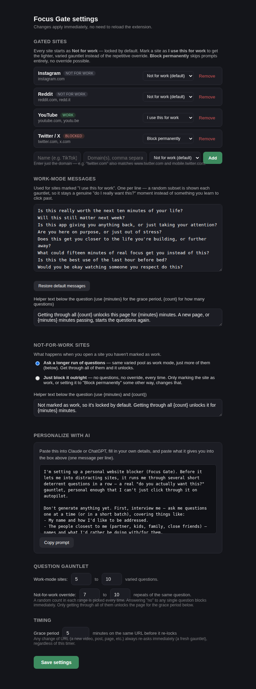
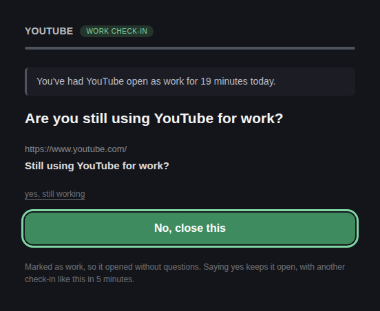
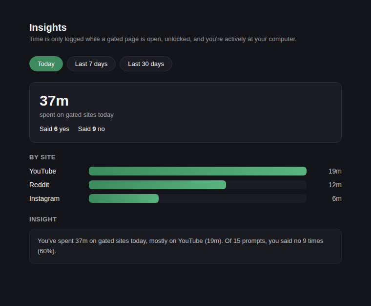
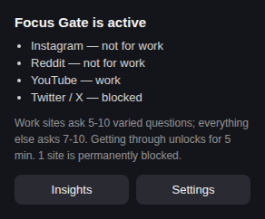

# Focus Gate

**[Landing page & privacy policy →](https://tinykite-co.github.io/focus-gate/)**

A personal Chrome extension that gates distracting sites behind a
deterrent-question gauntlet, with three levels per site.

  
  

## The three site states

Every site you add starts as **Not for work** — nothing is assumed to be
work by default. Change a site's state any time in Settings:

1. **I use this for work** — no questions at all. It just opens. A
   silent timer starts for `graceMinutes` (default 5); if the *same* URL is
   still open when it fires, you get one single, real check-in — "Are you
   still using this for work?" — not a gauntlet. Say yes and the timer
   re-arms; say no and it's blocked. A new URL on the site just restarts
   the timer silently.
2. **Not for work** (the default for every site) — the override gauntlet:
   `overrideMinQuestions`–`overrideMaxQuestions` (default 7–10) *varied*
   deterrent questions, each drawn from a ~350-line pool so it rarely
   repeats. Not a hard block: get through every single one and it unlocks
   for the grace period, then locks back to this state. You can instead set
   this to a flat block (Settings → "Not-for-work sites") with no override
   at all.
3. **Block permanently** — no prompt at all, ever, no override possible.
   For sites you never want a way in for.

In both gauntlets:
- Answer **no** to any single question → the tab goes straight to a
  blocked page. Nothing loads.
- Progress shows as "Question 3 of 7".
- **"No" is the big, easy default button. "Yes" is a small plain-text
  link** — on purpose, so saying yes takes an actual deliberate click every
  single question, not a reflex.
- Any navigation is caught, including in-page navigation (YouTube/Reddit
  swap pages via pushState without a full reload — treated as a URL change
  too).
- **Same URL:** you get the full grace period before it locks again and a
  fresh gauntlet starts.
- **URL changes:** re-gates immediately, no grace period.

## Deterrent messages

The ~350-line pool covers opportunity cost, goals/identity, future-self,
alternatives you could be spending the time on, habit-loop awareness,
health, legacy, and blunt/gentle framings. Fully editable in settings, and
there's a copyable "interview me, then write hundreds of personalized
lines" prompt (settings → Personalize with AI) to hand to Claude or
ChatGPT — it asks you about your people, ambitions and goals first, then
generates a set built specifically around your life.

**Every question is grounded in a real fact, not just a generic
guilt-trip.** Each one is prefixed with either:
- a fact about *your day so far* on that exact site — "This is the 3rd time
  you've opened Reddit today" / "You've already spent 22 minutes on
  Instagram today" — or, if today's actually been clean, an encouraging one
  instead: "You haven't opened YouTube at all today — a clean slate so
  far."; or
- a general, evidence-grounded fact about why these feeds pull at you and
  what you don't actually get back from them — variable-reward design,
  weak-tie "connection" standing in for real relationships, poor retention
  from passive scrolling, and so on. Whatever you tell yourself about
  staying informed or connected, the dopamine hit is the real mechanism at
  work, and it habituates fast.

These facts rotate question to question within one gauntlet, so it's never
the same fact twice in a row.

  

## Insights

While a gated page is unlocked and open, and you're actively at your
computer (not idle), it logs a minute of usage against that site. Click the
toolbar icon → **Insights** for a breakdown by site, a daily trend, and
your yes/no ratio — today, last 7 days, or last 30 days.

  
  

## Why this instead of the Chrome Web Store

Your Chrome Developer account is only needed to *publish* an extension
publicly. For something just for you, you don't publish it at all — you
load it locally in Developer Mode. Nothing goes through a public listing or
review queue, and no one but you has it. This is the standard way to run a
personal/private extension.

## Install (takes ~1 minute)

1. Open `chrome://extensions` in Chrome.
2. Turn on **Developer mode** (top-right toggle).
3. Click **Load unpacked**.
4. Select this `FocusGate` folder.
5. Done — Instagram, Reddit and YouTube start out as "Not for work" (the
   override gauntlet). Mark any of them "I use this for work" in Settings
   if that's not right. Pin the extension icon for quick access to the
   status popup.

## Uninstalling / pausing

- To pause: go to `chrome://extensions`, toggle Focus Gate off.
- To remove: click **Remove** on the same page.
- Only you can do either of these — it's a local extension, not something
  a website or anyone else can touch.

## Customizing

Click the extension icon → **Settings** (or right-click the icon → Options).
From there you can:

- Add or remove gated sites (name + one or more domains, comma-separated).
- Edit the prompt question and helper text (`{minutes}` is replaced with
  your grace period).
- Change the grace period (in minutes).

Changes save instantly — no reload needed.

## How it works (for your own trust/audit)

It's four files, all readable, no external network calls, no analytics:

- `manifest.json` — permissions.
- `settings.js` — shared defaults/helpers for reading & writing your config.
- `background.js` — the actual gating logic (per-tab approval state kept in
  `chrome.storage.session`, which clears when Chrome closes; a
  `chrome.alarms` timer enforces the re-lock).
- `gate.html` / `gate.js` — the "is this for work?" screen.
- `blocked.html` — shown when you say no.
- `options.html` / `options.js` — the settings page.
- `popup.html` — the small status popup from the toolbar icon.

It never reads page content, never talks to any server, and only acts on
the three site families listed above.
